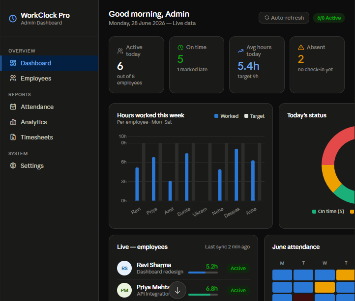
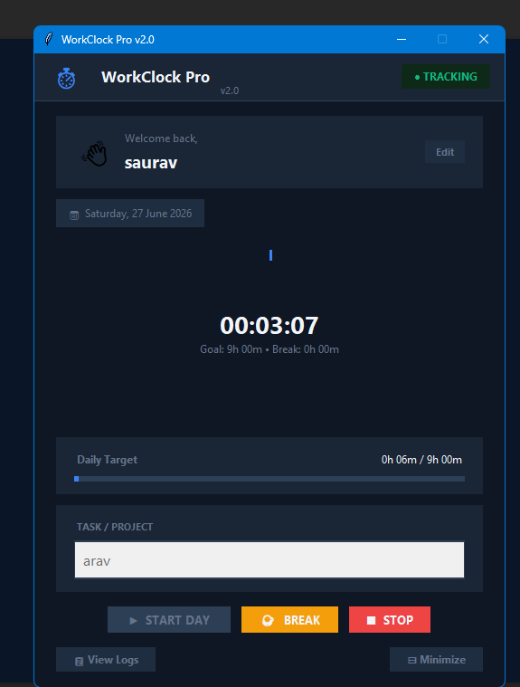
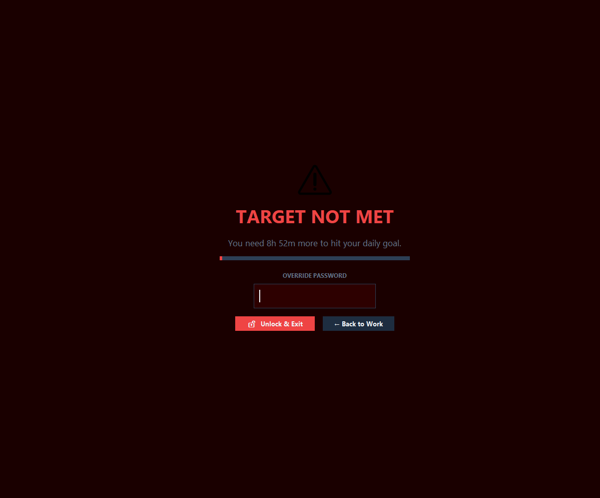

# ⏱️ WorkClock Pro

A modern desktop employee time tracking application built with Python, Tkinter, SQLite, and Supabase.

---

## 📸 Preview






---

## ✨ Features

- ✅ Employee Login
- ✅ Daily Time Tracking
- ✅ Break Timer
- ✅ Live Work Duration
- ✅ Daily Target Progress
- ✅ SQLite Local Database
- ✅ Supabase Cloud Sync
- ✅ Automatic Heartbeat
- ✅ Employee Registration
- ✅ Daily Timesheet Export
- ✅ Modern UI
- ✅ Dark Theme

---

## 🛠 Tech Stack

- Python
- Tkinter
- SQLite
- Supabase
- PyAutoGUI
- PyStray
- Pillow

---

## 📂 Project Structure

```
WorkClock-Pro/
│
├── main.py
├── database/
├── assets/
├── images/
├── README.md
└── requirements.txt
```

---

## 🚀 Installation

```bash
git clone https://github.com/arav144/WorkClock-Pro.git

cd WorkClock-Pro

pip install -r requirements.txt

python main.py
```

---

## ⚙️ Environment Variables

Create a `.env` file:

```env
SUPABASE_URL=your-project-url
SUPABASE_KEY=your-anon-key
```

---

## 🎯 Highlights

- Real-time employee tracking
- Secure cloud synchronization
- Offline SQLite support
- Daily work target monitoring
- Break management
- Professional desktop interface

---

## 📄 License

This project is for portfolio and educational purposes.

---

## 👨‍💻 Developer

**Arav Jha**

If you like this project, don't forget to ⭐ the repository.
